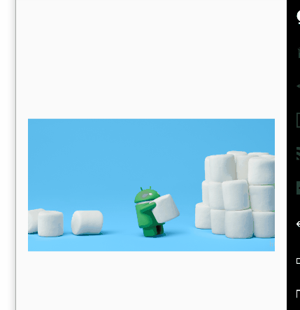

# CustomViews
this is a project define custom views


####1、LoopImageView

- **效果图**




- **xml中引入**

```
	<com.zhg.custom.view.LoopImageView
        android:id="@+id/id_image_view"
        android:layout_width="match_parent"
        android:layout_centerVertical="true"
        app:move_speed="2" <!--设置每毫秒移动的像素数-->
        app:src="@mipmap/android_m_hero_1200" <!--设置图片-->
        android:background="#88ff0000"
        android:layout_height="wrap_content" />
```

- **Java中引用**

```
		mImageView=new LoopImageView(this);
        mImageView.setBitmap(
        BitmapFactory.decodeResource(getResources(),R.mipmap.android_m_hero_1200));
        //设置图片资源
        mImageView.setMoveSpeed(10);//设置每毫秒移动像素数

```
